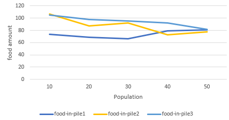
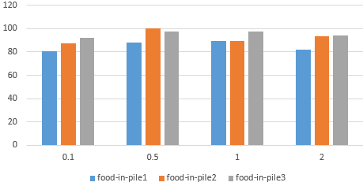

Комп'ютерні системи імітаційного моделювання
СПм-24-3, Макаренко Владислав Сергійович
Лабораторна робота №1. Опис імітаційних моделей та проведення обчислювальних експериментів

Варіант 10, модель у середовищі NetLogo:
Ants

## Вербальний опис моделі
У цьому проєкті колонія мурах шукає їжу. Хоча кожна мураха дотримується набору простих правил, колонія загалом поводиться досить складно.
Коли мураха знаходить шматок їжі, вона несе його назад до гнізда, залишаючи на своєму шляху хімічну речовину. Інші мурахи, «відчуваючи» цю речовину, слідують за хімічним слідом у напрямку їжі. Чим більше мурах переносять їжу до гнізда, тим сильніше вони підсилюють хімічну доріжку.
Зазвичай колонія починає споживати джерела їжі по черзі: спочатку те, що розташоване найближче до гнізда, і закінчує тим, що знаходиться найдалі. Мурахам важче сформувати стабільний шлях до віддаленого джерела, оскільки хімічний слід встигає більше випаровуватися й розсіюватися, перш ніж буде підсилений.
Після того як колонія завершує збирання найближчої їжі, хімічний слід до неї природно зникає, що звільняє мурах для збирання інших джерел. Віддалені джерела їжі потребують більшої «критичної кількості» мурах, щоб утворити стабільний слід.

## Керуючі параметри
POPULATION - кількість мурах у колонії, створюється під час SETUP.
EVAPORATION-RATE - швидкість випаровування феромону на кожному такті.
DIFFUSION-RATE - інтенсивність розповсюдження феромону по сусідніх клітинах.

## Внутрішні параметри
chemical - кількість хімічного сліду на цій клітинці
food - кількість їжі на цій клітинці (0, 1 або 2)
nest? - позначка, чи є клітинка частиною гнізда (true/false)
nest-scent - значення, яке тим більше, чим ближче клітинка до гнізда
food-source-number - номер джерела їжі (1, 2 або 3)

## Показники роботи системи
Під час моделювання система може відображати:
кількість їжі у кожній із трьох купок як функцію часу (графік у моделі);
швидкість зникнення феромону (візуально через інтенсивність зеленого кольору);
інтенсивність руху мурах на певних ділянках маршруту (густина агентів на феромонних трасах).

## Недоліки моделі
У природі колонії мурах зазвичай спочатку повністю використовують одне джерело, а потім інше (не обидва одночасно).
У цьому проєкті мурахи використовують «трюк», щоб знайти дорогу назад у гніздо: вони слідують за «запахом гнізда». У реальних мурах існують різні механізми орієнтування.
Мурахи реагують лише на рівні хімічної речовини між 0.05 і 2. Нижня межа потрібна, щоб уникнути «нескінченної чутливості».

## Обчислювальні експерименти
## Експеримент 1 - Вплив POPULATION (чисельності мурах)
Мета: визначити, як кількість мурах впливає на швидкість збору їжі.
Змінний параметр population = 10, 20, 30, 40, 50
Фіксовані: diffusion-rate = 1, evaporation-rate = 0.05
Тривалість симуляції: 500 ticks
| Population | Food in pile 1 | Food in pile 2 | Food in pile 3 |
|------------|----------------|----------------|----------------|
| 10         | 74             | 107            | 105            |
| 20         | 69             | 87             | 98             |
| 30         | 66             | 92             | 95             |
| 40         | 79             | 73             | 92             |
| 50         | 81             | 78             | 82             |

Висновки експерименту
1. Вплив розміру популяції на швидкість збору їжі
При малих популяціях (10–20 мурах) споживання їжі дуже повільне - залишки великі.
При середній популяції (30-40) споживання помітно прискорюється.
При великій популяції (50) - найефективніше: значення найнижчі для всіх трьох купок.
Висновок: чим більше мурах - тим швидше формується феромонна доріжка, і тим швидше колонія колективно збирає їжу.

2. Порівняння між купками
Pile 1 (найближча до гнізда) завжди споживається швидше за інші.
Pile 3 (найдальша) найгірше обробляється при малих і середніх популяціях.
При кількості мурах = 50 різниця між купками вирівнюється, бо велика кількість мурах підтримує стабільні феромонні траєкторії навіть на великий відстані.

3. Загальна тенденція
Колонія мурах демонструє нелінійну продуктивність:
перехід від 10 - 20 мурах дає невелике покращення;
від 20 до 30 - значне;
від 40 до 50 - найсуттєвіше прискорення збору.

## Експеримент 2 - Вплив EVAPORATION-RATE (швидкість випаровування)
Мета: дослідити, як швидкість випаровування феромону впливає на формування стійких трас і швидкість збору.
Змінний параметр: evaporation-rate = 0.05, 0.15, 0.25, 0.35, 0.45
Фіксовані: population = 20, diffusion-rate = 1
Тривалість: 500 ticks

| Evaporation rate | Food in pile 1 | Food in pile 2 | Food in pile 3 |
|------------------|----------------|----------------|----------------|
| 0.05             | 81.58424908    | 91.21062271    | 94.57875458    |
| 0.15             | 88.34790528    | 91.05464481    | 101.3624772    |
| 0.25             | 79.29014599    | 86.74452555    | 98.43248175    |
| 0.35             | 85.72131148    | 93.40983607    | 94.41894353    |
| 0.35             | 91.09403255    | 88.85714286    | 102.1030741    |

Тренд по evaporation-rate:
При низькому evaporation-rate (0.01) залишок їжі найменший, особливо в першій купі - це означає, що мурахи швидко формують стабільні маршрути і ефективно збирають їжу.
Зі збільшенням evaporation-rate до 0.05–0.1 кількість залишеної їжі зростає, але не критично.

При великому evaporation-rate (0.2) залишок їжі у першій та другій купі суттєво зростає, що свідчить про слабку стабільну трасу і менш ефективний збір.
Вплив на стабільність трас:
Низький evaporation-rate - феромон довше залишається на маршруті → мурахи швидко знаходять і підтримують оптимальний шлях - менше food_remaining.
Високий evaporation-rate - сліди швидко зникають → маршрути не стабілізуються → мурахи більше «блукають» - більше їжі залишається на купах.
Загальні спостереження:
Найефективніше збирання їжі спостерігається при evaporation-rate = 0.01.
Надто швидке випаровування (0.2) знижує ефективність збору.
Тенденція підтверджує очікування: чим вища швидкість випаровування феромону, тим складніше мурахам сформувати стійкі маршрути.

## Експеримент 3 - Вплив DIFFUSION-RATE (дифузія феромону)
Мета: зрозуміти, як розтікання феромону по сусідніх патчах впливає на точність маршруту і ефективність збору.
Змінний параметр: diffusion-rate = 0.1, 0.3, 0.5 , 0.7
Фіксовані: population = 20, evaporation-rate = 0.05
Тривалість: 500 ticks

Аналіз:
Низька дифузія (0.1):
Залишок їжі відносно низький у всіх купах - маршрути точні і ефективні.
Феромон концентрується на маршруті, мурахи швидко знаходять оптимальні шляхи.
Помірна дифузія (0.5 - 1):
Залишок їжі зростає, особливо у другій купі (100.39 при 0.5) - феромон розтікається занадто широко - мурахи трохи «розсіюються», ефективність збору падає.
При diffusion-rate = 1 залишок трохи нижчий, але все ще більший, ніж при 0.1.
Висока дифузія (2):
Залишок їжі знову зменшується - феромон швидко розподіляється, можливо з’являються нові альтернативні маршрути - частково компенсує розсіювання, але точність маршруту може знижуватися.
Тенденція:
Сильна дифузія не завжди означає кращу ефективність: помірне розтікання може збільшити плутанину.
Низька дифузія забезпечує точні, стабільні маршрути і мінімальний залишок їжі.
